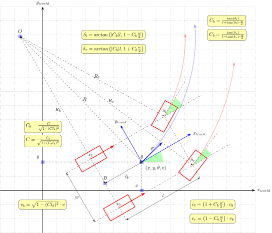

# Ackermann vehicle

Ackermann steering geometry is a geometric arrangement of linkages in the steering of vehicle designed to solve the problem of wheels on the inside and outside of a turn needing to trace out circles of different radius. The intention of Ackermann geometry is to avoid the need for tires to slip sideways when following the path around a curve. The geometrical solution to this is for all wheels to have their axles arranged as radius of circles with a common centre point. As the rear wheels are fixed, this centre point must be on a line extended from the rear axle. Intersecting the axes of the front wheels on this line as well requires that the inside front wheel be turned, when steering, through a greater angle than the outside wheel.

In our implementation, each front wheel is controlled by a separate servo.

## Model
State of system is $(x, y, \theta, v, C)$:
- $(x, y)$ – position of base point in the world
- $\theta$ - yaw, current orientation in the world
- $v$ – instant linear velocity of base point
- $C$ – instant curvature ob base point movement

Control input is tuple of curvature, desired linear speed and acceleration $(C, v, a)$, where $C > 0$ is left.
We make the assumption that steering angle of front wheels is achieved instantly, but consider desired acceleration to achieve target velocity for more smooth control.

System has the following limits:
- Velocity limited $v \in [v_{min}, v_{max}]$, backward movement is possible ($v_{min} < 0$).
- Acceleration is limited $a \in [a_{min}, a_{max}]$.
- The center of rotation is out of chassis $|С| < \big( l_b^2 + (\frac{w}{2} + \epsilon)^2 \big)^{-\frac{1}{2}}$.
- Wheels steering is constrained with the link system $\delta_l, \delta_r \in [\delta_{min}, \delta_{max}]$, where ($\delta > 0$) is left.
