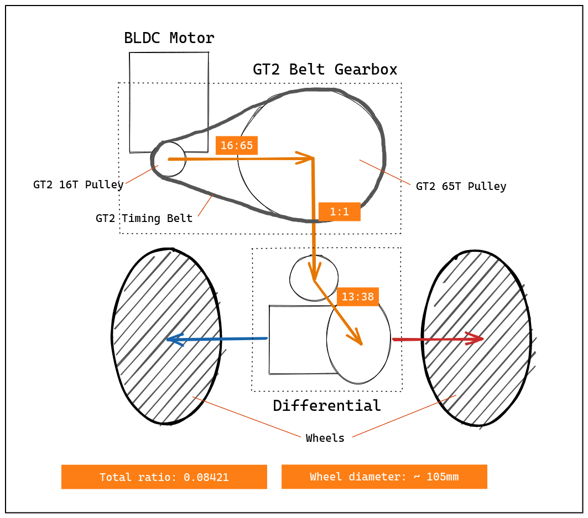

# Gearbox & differential transmission

- Motor to differential ratio: **(16 / 65) * (13 / 38) = 8 / 95 &thickapprox; 0.08421**
- Wheel diameter: **0.105 m** (radius: **0.0525 m**)
- For each **100 turns** of motor rear wheels make **100 * 0.08421 &thickapprox; 8.4 turns**, traveling distance of **8.4 * PI * 0.105 &thickapprox; 2.77 m**

[Edit in excalidraw](https://excalidraw.com/#json=YWuY4R6Dwvgntv3lw4HMn,Wu6pbtCz8jfEcrqzUD1GEQ)

