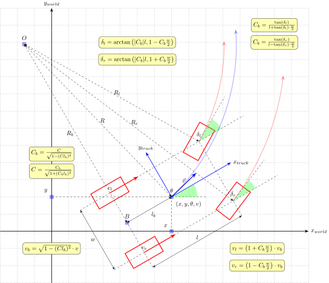

# Model

## Overview
[Ackeramnn model](../../doc/ackermann_vehicle.md) parameters and some simple calculations.



# Robot Description
## Overview
Publishes the robot static transform tree through `robot_state_publisher`.

`config/model.yaml` is still the source for kinematic limits, shape, lidar
parameters and simulator/model calculations. It is no longer the primary source
for `/tf_static` in normal launch files.

The current frame tree uses `base` as the robot body frame:

```
odom/world -> base
base -> body
base -> rear_axle
base -> rear_axle_fix
base -> lidar_link
base -> camera_link -> camera_* frames
base -> *_wheel
base -> laser_left -> laser_right
```

The two S2 lidar calibration pipeline owns `base -> laser_left` and
`laser_left -> laser_right` while it is running.

## Parameters
- `model_path` — path to URDF file. Defaults to `urdf/truck.urdf`.

### Output
- `/tf_static`
